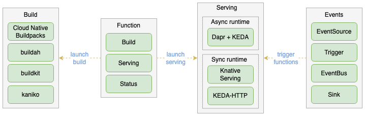

经过超过三年的开发，`Knative`近期发布了[1.0版本](https://knative.dev/blog/articles/announcing-knative-1.0/)，标致着它的核心组件(`Serving`,`Eventing`)已经可用。这说明了整个`Kubernetes`社区内包括 `OpenFaas`,`OpenWhisk`,`Kubeless`,`Fn`等等在内的无服务器框架生态的成熟度。这些框架仅仅专注提供函数的容器化打包，但并不提供完整功能的函数即服务(`FaaS`)平台。

[OpenFunction](https://github.com/OpenFunction/OpenFunction)是(KubeSphere)[https://kubesphere.io/]团队支持的一个开源项目，2021年三月发布了第一个版本。它旨在增强现有的框架，在`Kubernetes`上构建并运行事件驱动的函数，提供一个端到端的`FaaS`平台。


## OpenFunction组件

目前，OpenFunction分为四个自定义的资源类型(`CRDs`)：

* `Function`: 通过协调`Builder`和`Serving`组件来控制整个函数的生命周期
* `Builder`: 将函数编译、构建、发布到镜像仓库
* `Serving`: 运行函数并控制扩缩容事件
* `Domain`: 为函数提供一个服务入口



`OpenFunction`在引擎内使用以下几个开源项目来实现每个`CRD`：

* `Builder` 使用了 (Shipwright)[https://shipwright.io/] 和 (Cloud Navite Build Packs)[https://buildpacks.io/] 来编译和构建函数代码到容器内
* `Serving` 支持 (Knative)[https://knative.dev/docs/]和 `OpenFuncAsyns`,运行时基于(KEDA)[https://keda.sh/]和(Dapr)[https://dapr.io/]
* `Domain` 默认使用nginx-ingress
* 另外，(cert manager)[https://cert-manager.io/] 和 (Tekton Pipeline)[https://tekton.dev/] 用来将所有的组件组合起来

OpenFunction 提供了一个便捷的[命令行工具](https://github.com/OpenFunction/cli)用来安装所有的组件，但在这个演示中，我们会使用原始的安装脚本在`Minikube`中安装和运行一些示例。

## 启动Minikube

OpenFunction 被设计可以运行在任何`Kubernetes`发行版内，在这个演示中，我们使用`Minikube`作为`Kubernetes`演示环境。由于`OpenFunction`的组件依赖，`Minikube`至少需要2个CPU和4GB的内存：

```bash
$ minikube start -cpus 2 -memory 4096
```
*备注: minikube需要运行1.19或更高版本的Kubernetes*

接下来，我们需要为`Builder`组件提供一个用来推送镜像的凭据。这里我会使用`Docker`，理论上任何镜像仓库都可以使用。

```bash
$ kubectl create secret docker-registry regcred -docker -server=https://index.docker.io/v1/ -docker-username=<myUsername> -docker-password=<myPassword>
```

## 安装OpenFunction

现在我们做好了安装`OpenFunction`的准备工作。克隆(OpenFunction)[https://github.com/OpenFunction/OpenFunction]的代码仓库并检查`hack/deploy.sh`脚本。

作为一个基础的演示，我们只需要`Shipwright`,`Knative`,`cert-manager`作为依赖。

```bash
$ sh hack/deploy.sh -with-shipwright -with-knative -with-cert-manager
```

下一步，安装`OpenFunction`:

```bash
$ kubectl create -f https://github.com/OpenFunction/OpenFunction/releases/download/v0.4.0/bundle.yaml
```

等待controller manager的状态变为`Running`且健康状态为正常.

```bash
$ kubectl get po -n openfunction -w
NAME READY STATUS RESTARTS AGE
openfunction-controller-manager-6955498c9b-hjql7 2/2 Running 0 2m2s
```


## 部署第一个函数

示例中所有的应用都在[samples](https://github.com/OpenFunction/samples)仓库中提供，但是当前只有`golang`版本有完整的文档。我也使用`golang`作为示例，如果使用其他支持的语言，只需要修改以下yaml文件的必要字段。（openfunction.yaml）:

```yaml
apiVersion: core.openfunction.io/v1alpha2
kind: Function
metadata:
  name: function-sample
spec:
  version: "v1.0.0"
  image: "<your-docker-registry>/sample-go-func:latest"
  imageCredentials:
    name: regcred
  port: 8080 # default to 8080
  build:
    builder: openfunction/builder:v1
    env:
      FUNC_NAME: "HelloWorld"
      FUNC_TYPE: "http"
    srcRepo:
      url: "https://github.com/OpenFunction/samples.git"
      sourceSubPath: "latest/functions/Knative/hello-world-go"
  serving:
    runtime: "Knative" # default to Knative
    template:
      containers:
        - name: function
          imagePullPolicy: Always
```

创建函数:

```bash
$ kubectl create -f openfunction.yaml
```


如果发生错误，检查创建出来的`Pod`或者检查`Pod`的日志。

```bash
$ kubectl get functions.core.openfunction.io
$ kubectl get servings.core.openfunction.io
```


## 测试示例函数

当函数工作负载成为运行状态并且健康状态是正常时，我们可以将服务进行暴露来触发事件。

新建一个终端，创建一个可以访问minikube内部服务的tunnel

```bash
$ minikube tunnel
```


使用如下命令获取我们的函数`URL`:

```bash
$ kubectl get svc
```


访问服务（替换为你环境中的URL）:

```bash
$ curl http://serving-rjgqg-ksvc-zf8j2.default.127.0.0.1.sslip.io
```

正常情况下我们会看到 “Hello，World！”

## 未来的工作

由于`OpenFunction` 使用 `Knative` 实现自身的运行时组件，所以可以兼容所有的[Knative examples](https://knative.dev/docs/serving/samples/) 。从个人经验来看，对于已经使用`Kubernetes`集群的团队，无服务器框架可以让开发人员快速运行任意的业务函数(例如：当事件X发生时发送邮件、当webhoo被k触发时执行一个数据转换任务)。在本文的第二部分中，我们将探索一个更现实的无服务器场景。


[原文地址](https://yitaek.medium.com/getting-started-with-openfunction-896e7b27b690)