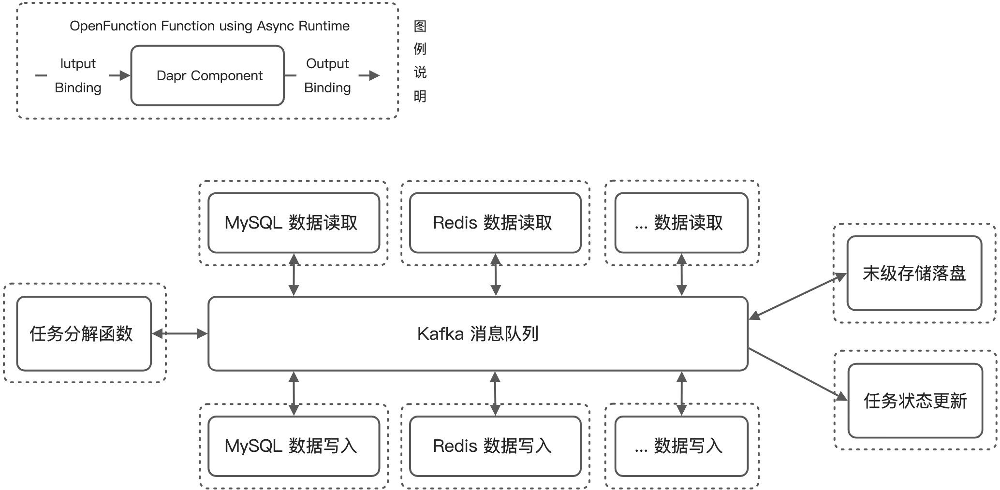

[OpenFunction](https://github.com/OpenFunction/OpenFunction) 是 [KubeSphere](https://kubesphere.com.cn/) 社区开源的一个函数即服务（FaaS: Function-as-a-Service）项目，作为一个 Serverless 应用框架，它能够帮助开发者专注于他们的业务逻辑，而不必担心底层运行环境和基础设施。利用 OpenFunction 优秀的云原生 FasS 平台能力，我们尝试构建了一个 Serverless 化的数据归档（及分发）系统，用于满足业务上可扩展、运维上资源可弹性伸缩、以及开发上高效简便的几个核心诉求。

本文将分为一下几个部分来展开：

- 首先是介绍我们的主要业务场景和系统构建的背景
- 其次是分析为何选择 Serverless 的架构方式来进行系统建设
- 最后我们将简要的介绍如何通过 OpenFunction 来实现系统并满足我们的核心研发诉求

## 业务场景介绍

[数据归档](https://baike.baidu.com/item/%E6%95%B0%E6%8D%AE%E5%BD%92%E6%A1%A3/10033756) 是各类在线业务系统中的一项常见功能需求，在自动驾驶领域也不例外。对于自动驾驶的云端平台而言，抛开通常会专门维护管理的用于 AI 训练的大数据，会有大量在常态化运营状态下生成的车端数据，这些数据是非常具有时效性特征的（即数据的价值随着时间的流逝而流失），对于这部分数据我们通常会分阶段地对他们进行存储的降级（即逐步向低成本大容量的低频存储搬迁）。

这样的存储降级及搬迁虽然看似不如运营业务逻辑复杂，但在实际实施过程中其实还是面临不少问题的，处理的不好甚至可能对生成运营环境产生影响。我们这里以几个典型的问题为例：

- **数据存储种类多**：不管是数据源还是目标数据存储，通常在数据处理相关的业务场景下都会有比较多的种类。单从类型角度来看，关系型数据存储、键值数据存储、文档型存储、时序数据存储、对象存储就已经种类繁多了，更不用说每个分类下面还有非常多有代表性的数据库或数据存储产品，那如何高效的面向这些存储获取和写入数据就是首先要解决的问题。
- **数据规模不统一**：存储种类繁多的另一个引申问题是不同业务对于存储的使用情况也存在差异。比如对于自动驾驶或者物联网场景，在运营过程中会产生大量时序性数据；对于 OA 办公自动化领域可能产生的文档型数据就会比较多；所以即使同样是进行数据归档，不同的数据存储在不同的业务系统中实际产生的工作负载也会有很大的差异。
- **同异步操作混合**：在具体实施归档的过程中，也是由于数据存储的原生读写方式不同，往往存在同步和异步的数据访问方式混用的情况，这对数据操作服务的编写提出了挑战。
- **业务过程可观察**：上述几个问题综合在一起，会需要我们为整个业务过程的执行提供更好的可观察性能力支持 —— 为每一次批量操作提供尽可能细粒度的执行过程状态反馈。

## OpenFunction 可以带来什么

基于这几个典型问题，我们首先不难想到可以利用微服务架构作为解决 “数据存储种类繁多” 这个核心问题的基础支撑，这样我们可以把操作不同数据存储的操作封装到一个个微服务中，并分派给不同的团队成员使用自己偏好和熟悉的编程语言进行开发。

但这样的拆分对于任务串联带来了困难，同时也需要解决数据规模增长后是否能够对应扩展服务规模的问题。从服务按需扩展这个弹性伸缩的问题上，我们倒是可以进一步想到 Serverless 架构是一个不错的解决思路，虽然任务串联仍然是个问题，同时对于同步和异步的混合操作可能还是没有什么 Serverless 体系内的规范可以指导服务开发。

这些问题一直伴随着我们的技术选型过程，直到我们发现了 OpenFunction 项目。下面我们用一个表格来大致对比一下三种架构方案在解决这些问题上的思路。

|  | **OpenFunction FaaS 方案** | **一般 Serverless 架构方案** | **基础微服务架构方案** |
| --- | --- | --- | --- |
| **数据存储种类多** | 构建 “函数粒度” 的微服务来分别处理各类数据存储 | 构建 “应用或函数粒度” 微服务 | 构建 “应用粒度” 微服务 |
| **数据规模不统一** | 提供自动伸缩能力（基于 [KEDA](https://keda.sh/) 提供，可缩至 0 副本）  | 提供自动伸缩能力（可缩至 0 副本） | 可以实现自动伸缩（至少保留 1 个副本） |
| **同异步操作混合** | 同时具备同步及异步运行时框架（分别基于 [Knative](https://knative.dev/docs/) 和 [Dapr](https://dapr.io/) 实现） | 比较少见有框架提供异步运行时框架 | 通常各服务各自实现（依靠服务框架） |
| **业务过程可观察** | 社区正在积极推进与 [SkyWalking](https://skywalking.apache.org/) 等可观察性框架的对接 | 依靠 Serverless 框架自身能力 | 通常各服务各自实现（依靠服务框架） |

## 使用 OpenFunction 实现数据归档

在了解了基于 OpenFunction 来解决以上核心问题的思路后，我们便可以展开实际的业务系统构建工作。在 OpenFunction 的四套核心组件中（如以下 [OpenFunction CRD 关系图](https://github.com/OpenFunction/OpenFunction#customresourcedefinitions) 所示），我们主要会用到其中的 Function 和 Serving 这两大模块，Build 虽然也会使用但并不在业务执行阶段发挥作用，而 Events 模块暂时在现有系统中尚未引入（未来会用到）。

考虑到具体业务执行过程中存在较多长任务，因此下面所展示的系统业务架构中所有的 Function 都是通过基于 Dapr 实现的 [OpenFuncAsync](https://github.com/OpenFunction/OpenFunction#openfuncasync) 异步方式来相互调用和串联的。

上图展示了我们基于 OpenFunction 构建的数据归档系统的核心业务架构，业务流程方面其实很直接 —— 由一个任务拆解函数作为总入口，各个存储读写函数负责操作各类数据存储，最后所有数据汇入末级存储并调用状态更新函数汇报任务执行结果。下面让我们重点看一下 OpenFunction 帮助我们做了哪些工作：

- 首先，我们编写的 Go、Node.js 的函数通过 OpenFunction Build 被封装成对应的函数服务镜像供加载
- 然后我们通过 [Function CRD](https://openfunction.dev/docs/reference/function-spec/) 让我们的函数在异步执行模式（Async Serving）下开始运行：
  - 我们指定的函数服务会被进一步封装成 [Dapr Component](https://docs.dapr.io/concepts/components-concept/)
  - 我们可以按需声明一些关联的中间件服务（需要 Dapr Component [Bindings](https://docs.dapr.io/reference/components-reference/supported-bindings/) 或 [Pub/Sub Brokers](https://docs.dapr.io/concepts/components-concept/) 支持）
  - 对应不同的中间件，函数可以和它们做 Input 和 Output 的绑定（支持 Bindings 和 Pub/Sub）
- 由于 Serverless 架构的特性，函数服务在无流量时是被伸缩到 0 副本的，OpenFunction 会利用 [KEDA ScaledObject](https://keda.sh/docs/2.4/concepts/scaling-deployments/) 来监控流量并实施弹性伸缩

### OpenFunction 与 Dapr 惺惺相惜

不难发现 Dapr 是 OpenFunction 异步函数运行时的核心组件，从我们目前的开发使用体验来看，他们的作用是双向互补的。

- Dapr 使 OpenFunction 具备了良好的异步业务处理能力，而且在开发中我们也可以直接利用 Dapr 原生的体系做一些异步能力的扩展
- OpenFunction 给 Dapr 提供了一个很好的落地平台，而且一定程度上简化了 Dapr 的应用配置以及使用方式，比如 Component 和 Binding 配置的整合，比如调用 Dapr Binding 的方式也从调用 [Dapr Sidecar](https://docs.dapr.io/concepts/overview/#sidecar-architecture) 入口地址转为了简单的一行代码，`ctx.Send(data, "dapr_component_name")`

## 未来工作展望

如本业务案例所示，OpenFunction 不但以 Serverless 的方式提升了数据处理和流转业务的灵活度，还可以通过 OpenFunction 较为独有的异步函数运行时框架串联函数和中间件，让更多的开发时间可以专注在业务开发中。特别是对于 Dapr 框架熟悉的小伙伴完全可以利用 OpenFunction 来驱动和加速 Dapr 应用的开发和落地。

在本业务系统的持续迭代过程中，我们也会逐步引入同步函数运行时的使用，比如目前入口的任务拆解函数也是异步触发的，这个其实对于接入前端应该不是很方便，未来我们计划引入 [0.5.0](https://github.com/OpenFunction/OpenFunction/releases/tag/v0.5.0) 里程碑中会发布的 [Domain](https://github.com/OpenFunction/OpenFunction#customresourcedefinitions)（即同步函数绑定 Ingress 入口）能力，这样可以在入口函数层面都提供同步访问接口，也不影响之后的业务流程通过异步的消息通道进行组合串联。
